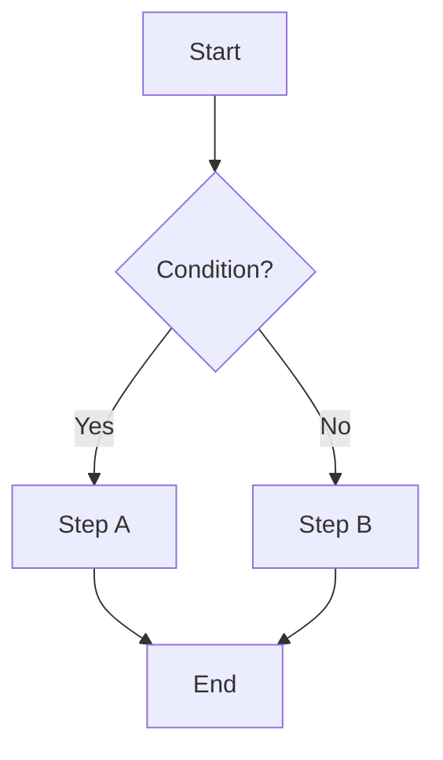
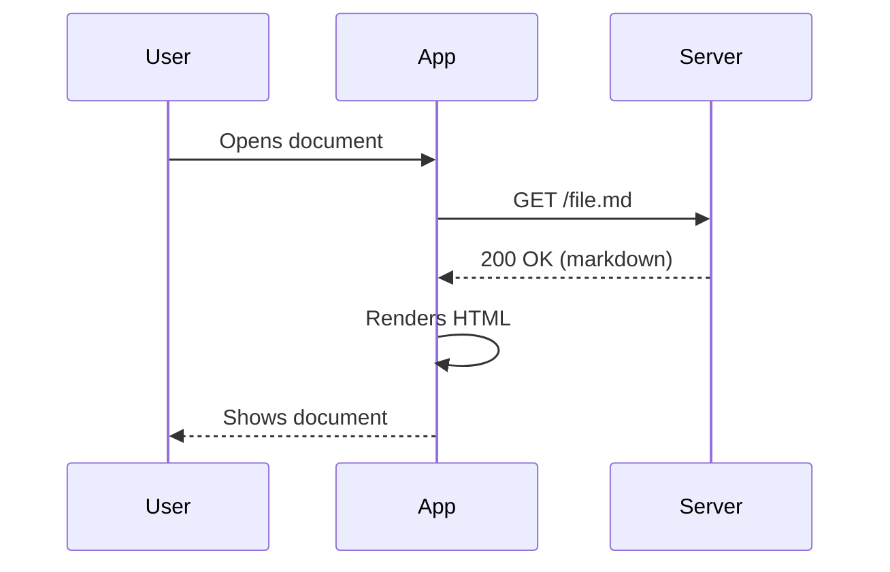
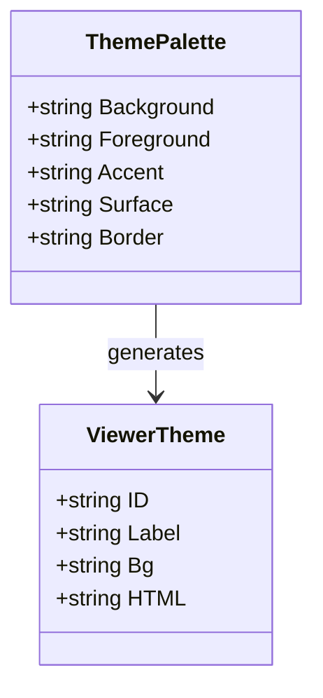
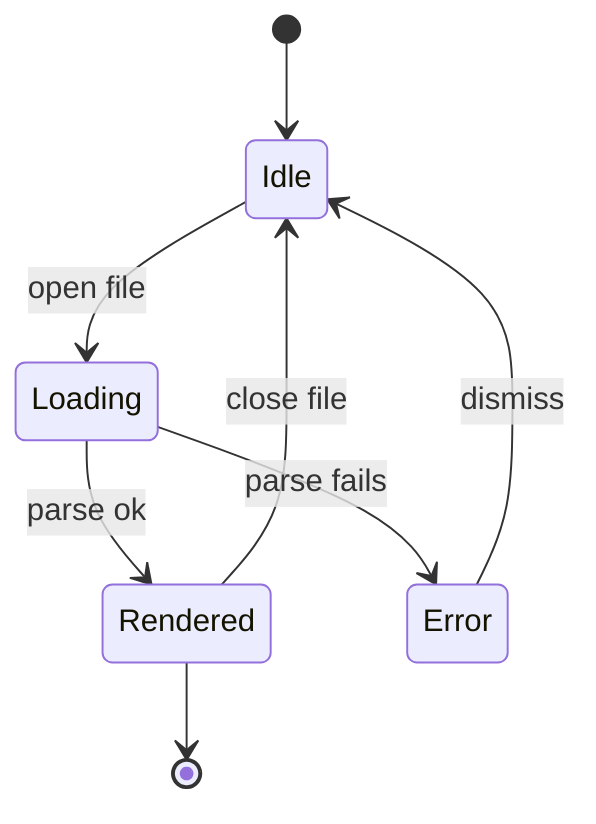
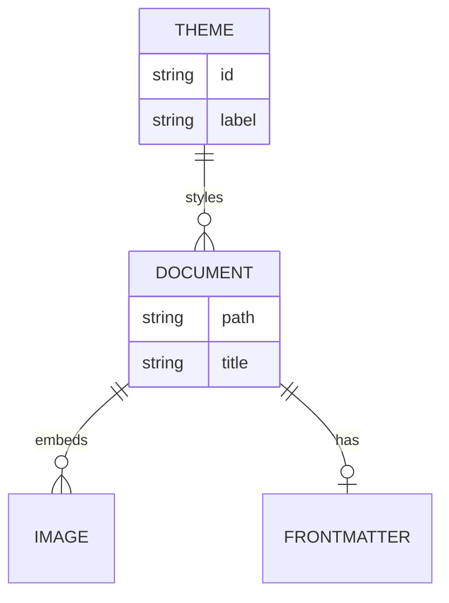
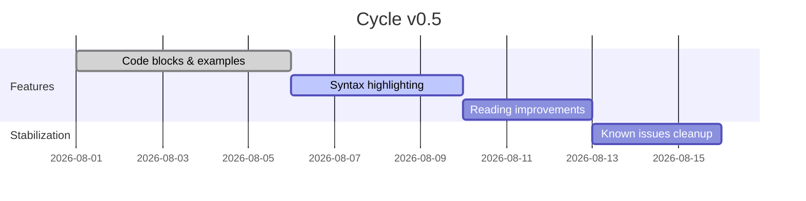
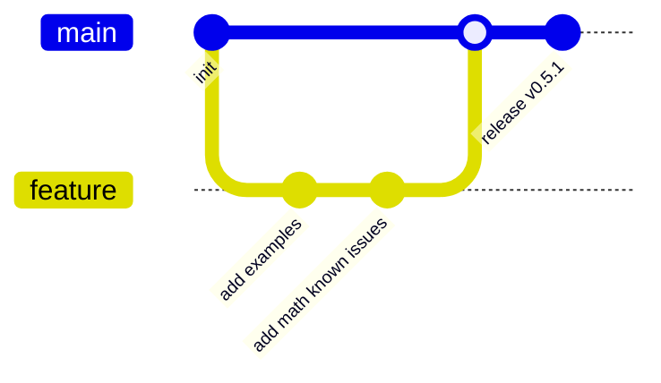
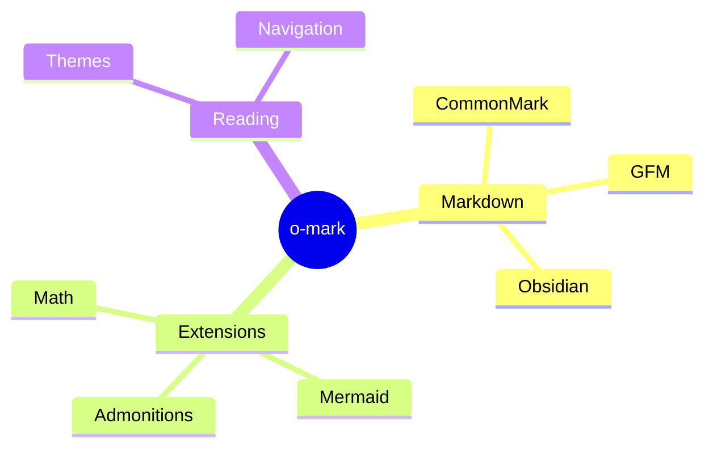
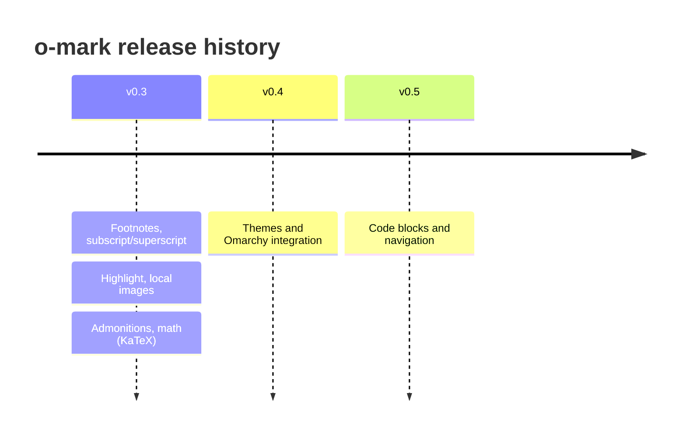

# Mermaid Diagrams

Validates that o-mark's `AssetPostLoad`-injected mermaid.js renders each of
the 9 diagram types the library supports: flowchart, sequence, class, state,
entity-relationship, gantt, git graph, mindmap, timeline. Each section is a
minimal but non-trivial example of that diagram's syntax.

---

## Flowchart

A decision tree with branching edges — checks node shapes (`[]`, `{}`) and
labelled edges (`-->|Yes|`):

---

## Sequence Diagram

Message passing between named participants, including a synchronous call, a
self-call, and a dashed return arrow:

---

## Class Diagram

Two classes with typed fields and a relationship arrow between them:

---

## State Diagram

A state machine with entry/exit points (`[*]`) and labelled transitions:

---

## Entity Relationship Diagram

Entities with cardinality-annotated relationships and one entity's attribute
list expanded:

---

## Gantt Chart

A project timeline with dated sections and task states (`done`, `active`,
pending):

---

## Git Graph

A branch, feature commits, and a merge back into `main` — checks branching
and merge rendering:

---

## Mindmap

A root node branching into multiple levels of nested children:

---

## Timeline

A chronological sequence of periods, one of them with multiple stacked
events:

