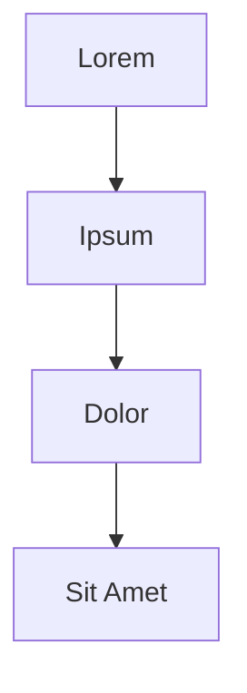

# General Markdown

Lorem ipsum dolor sit amet, consectetur adipiscing elit. Sed do eiusmod tempor
incididunt ut labore et dolore magna aliqua. Ut enim ad minim veniam, quis
nostrud exercitation ullamco laboris nisi ut aliquip ex ea commodo consequat.

## Heading 2 — Emphasis

Normal text, **bold text**, *italic text*, ***bold and italic***, ~~strikethrough~~.
Inline `code snippet` within a sentence. And a [link to example](https://example.com).

### Heading 3 — Lists

Unordered list:

- Item one with some lorem ipsum text to show wrapping behavior
- Item two
  - Nested item A
  - Nested item B
- Item three

Ordered list:

1. First item
2. Second item
   1. Nested ordered A
   2. Nested ordered B
3. Third item

#### Heading 4 — Blockquote

> Lorem ipsum dolor sit amet, consectetur adipiscing elit. Pellentesque habitant
> morbi tristique senectus et netus et malesuada fames ac turpis egestas.
>
> — Author Name

##### Heading 5 — Code Blocks

Inline code: `fmt.Println("hello, world")`

Fenced code block:

```go
package main

import "fmt"

func main() {
    for i := range 5 {
        fmt.Printf("Lorem ipsum %d\n", i)
    }
}
```

Shell example:

```bash
./src/target/o-mark docs/examples/general.md
```

###### Heading 6 — Tables

| Column A       | Column B       | Column C       |
|----------------|----------------|----------------|
| Lorem ipsum    | Dolor sit amet | Consectetur    |
| Adipiscing     | Elit sed do    | Eiusmod tempor |
| Incididunt ut  | Labore et      | Dolore magna   |

Table with alignment:

| Left           | Center         | Right          |
|:---------------|:--------------:|---------------:|
| Lorem          | Ipsum          | Dolor          |
| Sit amet       | Consectetur    | Adipiscing     |

---

## Horizontal Rule (above)

## Links and Images

External link: [OpenStreetMap](https://www.openstreetmap.org)

Local image (see images.md for full image tests). External URLs show the alt text as fallback:


---

## Definition Lists

Term
: Definition of the term with lorem ipsum dolor sit amet.

Another Term
: First definition line.
: Second definition line for the same term.

## Task Lists

- [x] Completed task
- [ ] Pending task
- [x] Another completed task
- [ ] Final pending task

---

## Footnotes

Here is a sentence with a footnote.[^1] And another one.[^2]

[^1]: This is the first footnote content.
[^2]: This is the second footnote, with `inline code` inside.

## Subscript and Superscript

Water molecule: H~2~O. Energy: E=mc^2^. Carbon-14: C~14~. Footnote-style: x^n+1^.

## Highlight

==Highlighted text== with ==lorem ipsum== and normal text in between.

## Math (LaTeX)

Inline: $E = mc^2$ and $\sum_{i=1}^{n} i = \frac{n(n+1)}{2}$.

Block:

$$
\int_0^\infty e^{-x^2} dx = \frac{\sqrt{\pi}}{2}
$$

## Mermaid Diagram



## Admonitions / Callouts

> [!NOTE]
> Lorem ipsum dolor sit amet, consectetur adipiscing elit.

> [!TIP]
> Ut enim ad minim veniam, quis nostrud exercitation ullamco.

> [!WARNING]
> Sed do eiusmod tempor incididunt ut labore et dolore magna aliqua.

> [!IMPORTANT]
> Duis aute irure dolor in reprehenderit in voluptate velit esse.

> [!CAUTION]
> Excepteur sint occaecat cupidatat non proident, sunt in culpa.
