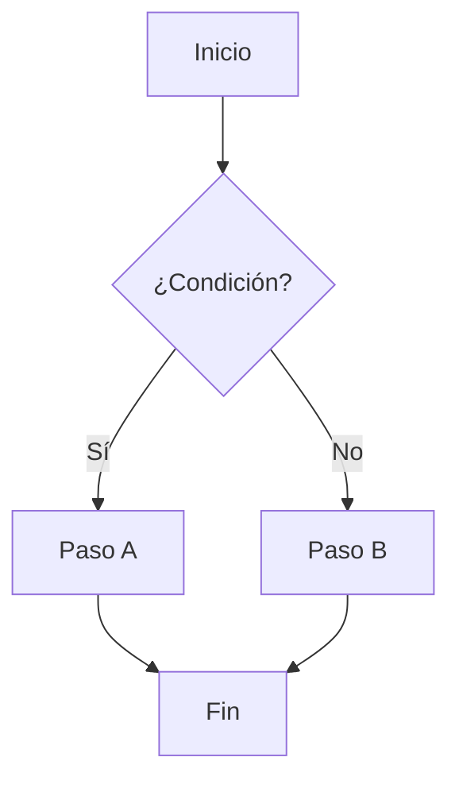
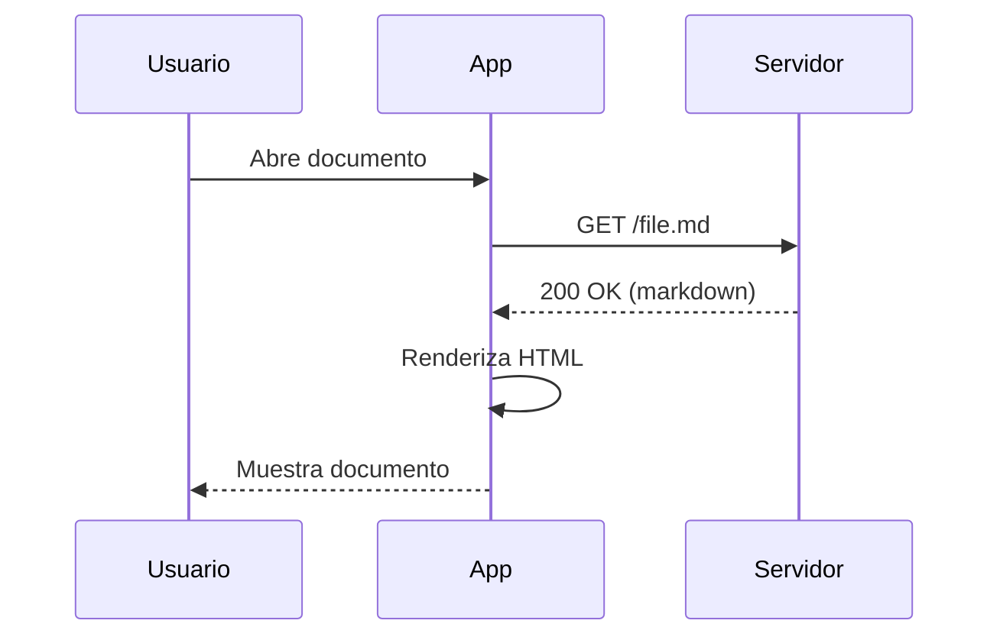
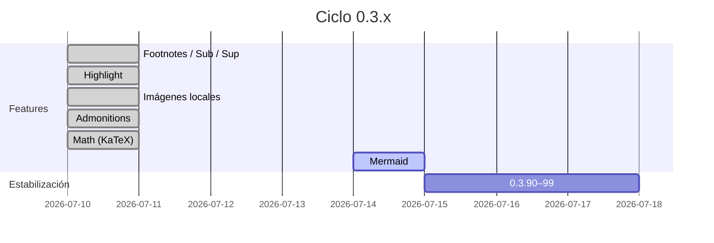
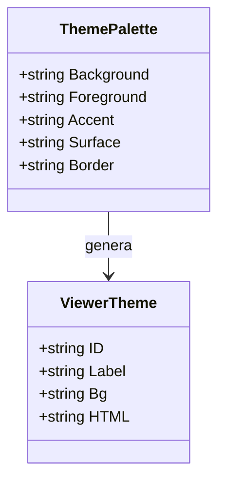

# Mermaid Diagrams

Flowchart, sequence diagram, gantt y class diagram.

---

## Flowchart

```mermaid
graph TD
    A[Inicio] --> B{¿Condición?}
    B -->|Sí| C[Paso A]
    B -->|No| D[Paso B]
    C --> E[Fin]
    D --> E
```

---

## Sequence Diagram

```mermaid
sequenceDiagram
    participant U as Usuario
    participant A as App
    participant S as Servidor

    U->>A: Abre documento
    A->>S: GET /file.md
    S-->>A: 200 OK (markdown)
    A->>A: Renderiza HTML
    A-->>U: Muestra documento
```

---

## Gantt Chart

```mermaid
gantt
    title Ciclo 0.3.x
    dateFormat  YYYY-MM-DD
    section Features
    Footnotes / Sub / Sup   :done, 2026-07-10, 1d
    Highlight                :done, 2026-07-10, 1d
    Imágenes locales         :done, 2026-07-10, 1d
    Admonitions              :done, 2026-07-10, 1d
    Math (KaTeX)             :done, 2026-07-10, 1d
    Mermaid                  :active, 2026-07-14, 1d
    section Estabilización
    0.3.90–99                :2026-07-15, 3d
```

---

## Class Diagram

```mermaid
classDiagram
    class ThemePalette {
        +string Background
        +string Foreground
        +string Accent
        +string Surface
        +string Border
    }
    class ViewerTheme {
        +string ID
        +string Label
        +string Bg
        +string HTML
    }
    ThemePalette --> ViewerTheme : genera
```
